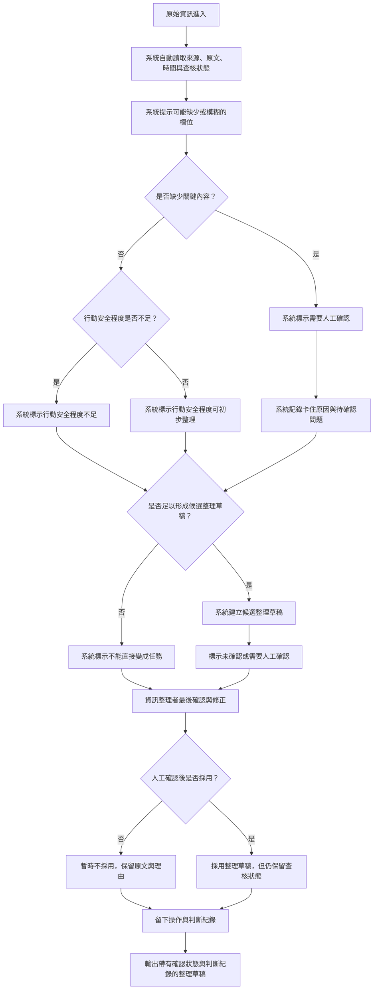

# 資訊流程設計

> 這份文件由 Codex 先產生草稿，請用 VS Code 預覽 Mermaid，並由人檢查流程是否合理。

## 我的 v1 目標

- 我優先服務的使用者：資訊整理者。
- 這個使用者最想完成的事：讓系統先自動整理來源、原文、時間、查核狀態與行動安全程度提示，最後由資訊整理者做確認，並保留判斷紀錄給下一位協作者。
- 我最想避免的錯誤：把信心程度高、AI 預填或未確認內容誤當成已確認資料，進而讓後續人員直接行動。

## 自然語言流程描述

```text
原始資訊進來後，系統先自動讀取來源、原文、時間、目前查核狀態與既有草稿。
系統可以自動標出可能缺少或模糊的欄位，產生行動安全程度提示與整理草稿，但不能判定資訊是否為真，也不能決定是否派工。

如果原始資訊缺少關鍵內容，例如來源不清、時間不明、地點或需求模糊、操作者不是當事人，系統先標示為需要人工確認。
如果資訊中的現場狀況、路線、需求急迫性或環境描述不足以支持安全行動，系統先標示行動安全程度不足，等待最後人工確認。
如果資訊看起來可能誤導行動者，或不足以轉成志工任務，系統保留原文與卡住原因，暫時不要建立可行動任務。

如果自動檢查後資訊足夠形成整理草稿，系統可以建立候選結果，但候選結果仍然標示為未確認或需要人工確認。
資訊整理者只在最後確認階段檢查系統提示、修正草稿、決定是否採用，並記錄這次判斷的依據、誰做了判斷、哪些內容來自原文、哪些是整理者補充或修正。
流程最後輸出的是「帶有確認狀態與判斷紀錄的整理草稿」，不是已確認任務，也不是救災行動決策。
```

## Mermaid 流程圖

請用 VS Code 預覽，確認流程圖能正常顯示。



## 人工確認點

- 最後確認系統自動讀取的來源、原文、時間與查核狀態是否被正確理解。
- 最後判斷來源是否是一手資訊，或只是群組轉錄、電話轉述、親友代述。
- 最後判斷原文是否足以支持地點、時間、需求、行動安全程度與下一步整理。
- 最後判斷系統標示的行動安全程度是否合理，是否仍不足以支持行動者採取行動。
- 最後判斷候選整理草稿是否仍只能停在「需要人工確認」，不能被視為已確認任務。

## 不能自動處理的分支

- 不能讓 AI 自動決定資訊是否為真。
- 不能讓 AI 自動把信心程度高的草稿改成已確認。
- 不能讓 AI 自動決定救災、派工或行動優先順序。
- 不能讓 AI 自動完成最後確認；最後採用或不採用仍要有人類判斷。
- 不能把所有原始資訊都強迫轉成候選結果；資訊不足時要保留卡住原因。

## 操作或判斷紀錄

- 誰做了人工判斷，以及判斷時間。
- 採用哪些原文作為依據。
- 哪些內容是整理者補充、修正或質疑 AI 預填。
- 為什麼某筆資訊暫時不採用，或為什麼不能直接變成任務。

## 我檢查後修正了什麼

- 原本：流程把個資、健康、長者、地址等敏感資訊公開風險納入主要分支。
- 修正後：本次假設可以忽略個資與敏感資訊分支，改成保留「行動安全程度」作為主要風險判斷。
- 為什麼：使用者希望流程聚焦在能不能安全轉成行動；但 AI 仍不能自動判定真偽、派工或決定行動優先順序。

## 我仍不確定的流程點

- 自動預填應該保留並強化標示，還是先拿掉以降低誤解風險。
- 行動者在 v1 是否應該看到任何草稿，或只看到人工確認後的內容。
- 「不能直接變成任務」要用固定原因選單，還是讓整理者用白話補充更合適。
